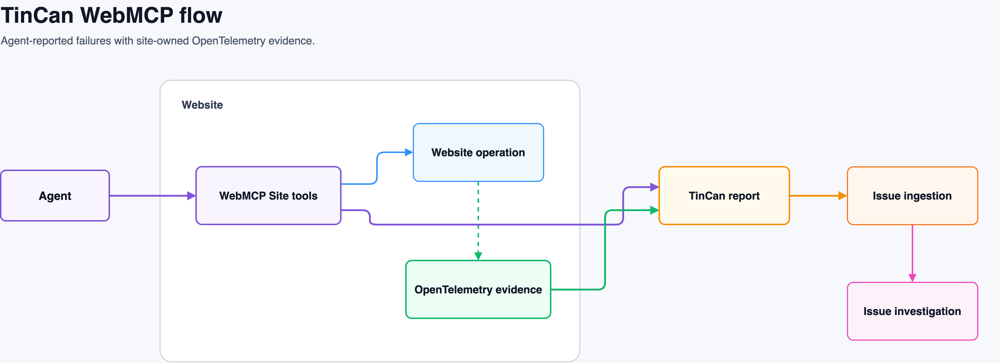

# Architecture

TinCan joins an agent's semantic observation with recent site-owned browser signals. The agent never receives the private diagnostic payload.

The editable diagram is available in [Draw.io format](architecture.drawio).

## Workspace packages

- `@tincan-webmcp/browser` provides incident assembly, sanitization, bounded logs and metrics, and HTTP transport.
- `@tincan-webmcp/otel-instrumentation` integrates official OpenTelemetry fetch and XHR instrumentation, adds the Resource Timing fallback, and retains spans for 120 seconds.
- `@tincan-webmcp/webmcp` registers `report_site_issue` through the document-scoped WebMCP API.
- `@tincan-webmcp/server` validates, re-sanitizes, classifies, and stores incidents.
- `@tincan-webmcp/otel` defines the OTLP-aligned incident signal types.

## Runtime flow

1. The website initializes TinCan once. It transparently instruments fetch and XHR through the OpenTelemetry JavaScript SDK; application request functions remain unchanged.
2. A passive Resource Timing observer captures same-document requests that bypass the patched global APIs, including requests initiated from a separate WebMCP execution realm.
3. The agent discovers the website's WebMCP tools, invokes a business operation, and verifies the result with a read tool when available.
4. After a failure, the agent calls `report_site_issue` with its expected and observed behavior.
5. TinCan snapshots the 120-second logs, metrics, and traces, then sends the sanitized incident to `/_tincan/issues`.
6. The API validates and re-sanitizes the payload, assigns an `INC-*` ID, and returns only the status and incident ID.
7. The admin UI displays the complete submitted report and its captured evidence.

Sites with an existing OpenTelemetry provider can register `createTinCanInstrumentations(...)` and `TinCanFlightRecorderSpanProcessor` with that provider, then pass the processor to `createTinCan`. The convenience setup creates a private browser provider only when no processor is supplied.

## Demo applications

`apps/demo-saas` contains the product, developer harness, and admin routes in one Vue application. `apps/api` is the Bun reference server with in-memory subscription and issue state. Vite proxies `/api` and `/_tincan` to the API during local development.

The demo exposes `add_licenses`, `remove_licenses`, `get_subscription`, `export_usage_report`, and `report_site_issue`. Adding one license persists two; removing one returns HTTP `504` without changing state.

## Current boundaries

The issue store is process memory only. Native OTLP/HTTP export, durable persistence, authentication, tenancy, Web Vitals, long-task collection, and backend trace correlation remain future work. Resource Timing fallback spans include URL path, timing, and Chromium response status, but cannot recover an HTTP method that was hidden by another JavaScript realm.
